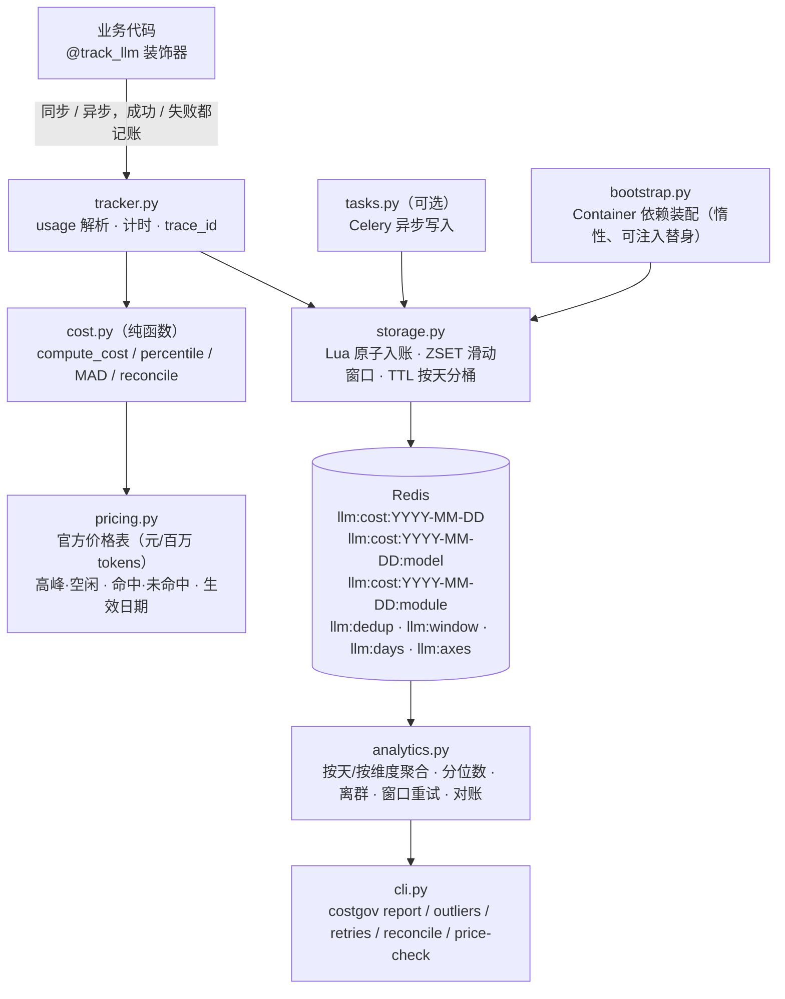

# llm-cost-governor

**一句话定位**：把「每一次 LLM 调用花了多少钱」变成**可核对、可告警、可复算**的事实 ——
按官方口径（元 / 百万 tokens、分高峰/空闲、分缓存命中/未命中）计价，
用 Redis Lua 原子幂等入账，用真实分位数与 MAD 做异常检测，并能与供应商账单对账。

版本 `2.0.0`。这是从一个「LLM 可观测性与成本治理中间件」重构而来：
旧版的 6 个真实缺陷（单位错、分位数错、O(全部历史) 的窗口扫描、重试重复计费、
key 无 TTL 导致总账与分账永远对不平、装饰器吞掉异步与失败调用）在本版逐条修掉，
并且每条都有专门的回归测试。

---

## 1. 架构



数据流的关键约定（也是旧版最混乱的地方）：

```
维度轴（axis）：model / module …          ← 「按什么分组」
维度值（value）：deepseek-flash / report  ← 「分组里的具体取值」
key 形态：llm:cost:2026-10-08:model       ← 该 Hash 的 field 才是「维度值」
```

一次入账会把**同一笔金额**同时写进总账和**每个**维度轴的分账，并且共享同一段 Lua 脚本、
同一份 TTL —— 所以「分账之和 == 总账」是**结构上成立**的事实，而不是靠事后对账去凑。

---

## 2. 快速开始

### 2.1 安装

```bash
python -m pip install -e ".[dev]"      # 含 pytest / pytest-asyncio / fakeredis
python -m pip install -e ".[worker]"   # 可选：Celery 异步写入
```

要求 Python ≥ 3.11（本仓库在 3.11 / 3.12 上跑 CI）。

### 2.2 不需要 Redis 的纯函数示例

成本、分位数、MAD 离群、对账全是**不依赖任何存储**的纯函数，可以直接这样用：

```python
from datetime import datetime
from decimal import Decimal
from costgovernor.cost import compute_cost

at = datetime(2026, 10, 8, 10, 0, 0)   # 北京时间周四 10:00 → 高峰时段
breakdown = compute_cost(
    "deepseek-flash",
    input_tokens=1_000_000,
    cache_hit_tokens=800_000,          # 其中 80 万命中缓存
    output_tokens=200_000,
    at=at,
)
print(breakdown.explanation())
print(breakdown.total)                 # 2.032 元
```

实测输出（单位是「元 / 百万 tokens」，不是 1K tokens）：

```
模型 deepseek-flash，时段 peak（2026-10-08T10:00:00+08:00）
计价单位：元 / 百万 tokens（价格生效日期 2026-01-01）
输入·缓存命中 800000 tokens × 0.04 元 / 百万 tokens = 0.032 元
输入·缓存未命中 200000 tokens × 2.0 元 / 百万 tokens = 0.4 元
输出 200000 tokens × 8.0 元 / 百万 tokens = 1.6 元
缓存带来的节省：1.568 元（相对全部按未命中计价）
合计：2.032 CNY
```

分位数与离群检测同样是纯函数：

```python
from statistics import quantiles
from costgovernor.cost import percentile, detect_outliers_by_mad, InsufficientSample, OutlierReport

costs = [0.01, 0.02, 0.03, 0.05, 0.08, 0.13, 0.21, 0.34, 0.55, 0.89]
percentile(costs, 0.95)                       # 0.737（线性插值）
percentile(costs, 0.95) == quantiles(costs, n=20, method="inclusive")[18]   # True

report = detect_outliers_by_mad([1.0] * 40 + [100.0], threshold=3.5, min_sample_size=30)
assert isinstance(report, OutlierReport) and report.outlier_count == 1

small = detect_outliers_by_mad([1.0, 2.0, 3.0], min_sample_size=30)
assert isinstance(small, InsufficientSample)   # 样本不足 → 明确返回，不硬算
```

### 2.3 没有 Redis 也能演示（内置内存替身）

```bash
# 幂等：同一条演示数据重复写入不会重复累加
costgov report --client fake --demo --days 1

# 滑动窗口：写入 12 次调用，阈值 8 次 / 窗口 60 秒 → 超阈值
costgov retries --client fake --demo 12 --window-seconds 60 --max-calls 8

# MAD 离群：43 个分组 + 1 条 500 元的离群记录
costgov outliers --client fake --demo
```

实测输出片段：

```
报表 2026-10-08（cost）（单位：元 / 百万 tokens）
  总成本：3.03 CNY   分组条目数：2
  按 model 分解：
    - deepseek-v4-pro: 1.53 CNY（50.50%）
    - deepseek-flash: 1.5 CNY（49.50%）
  token 合计：
    - cache_hit_tokens: 12000.0
    - cache_miss_tokens: 6000.0
    - output_tokens: 2400.0
  分位数（按分组金额）：p50=1.515, p90=1.527, p95=1.5285, p99=1.5297

—— 汇总 ——
  天数：1    分组条目数：2
  总成本：3.03 CNY
  按 model 汇总：
    - deepseek-v4-pro: 1.53 CNY
    - deepseek-flash: 1.5 CNY
  总账 3.03 vs 分账之和 3.03，差额 0.00 → ✅ 平
```

```
2026-10-08：样本 43，中位数 1.530000，MAD 0.030000，阈值 3.5，离群 1 个
    - 第 42 条：500.000000 （modified z=11207.267，high）
```

```
作用域：demo（存储后端：fake）
时间窗口：60 秒    8 次
窗口内调用次数：12
是否超阈值：是（疑似无效重试）
```

### 2.4 接真实 Redis

```bash
cp .env.example .env                     # 所有变量都以 CG_ 为前缀
docker compose up -d redis

costgov report     --client redis --days 7
costgov outliers   --client redis --day 2026-10-08
costgov retries    --client redis --window-seconds 60 --max-calls 8
costgov reconcile  --client redis --days 1 128.44 --strict
costgov price-check --model deepseek-flash --at "2026-10-08 20:00"
```

### 2.5 在业务代码里埋点

```python
from costgovernor.bootstrap import Container
from costgovernor.tracker import track_llm

container = Container()          # 惰性：这里不会连接 Redis

@track_llm(model="deepseek-flash", module="report", ledger=container.ledger)
def ask(prompt: str) -> dict:
    return client.chat.completions.create(...)  # 任何 SDK

@track_llm(model="deepseek-v4-pro", module="report", ledger=container.ledger)
async def ask_async(prompt: str):                # async 也支持
    return await aclient.chat.completions.create(...)
```

`@track_llm` 的行为：

* **同步与异步都支持**（`inspect.iscoroutinefunction` 分支包装，装饰后仍是协程函数）；
* 用 `time.perf_counter()` 计时（单调时钟，不受系统时间调整影响）；
* **失败调用也会记账**：在 `except` 里记一条 `status="error"` + 异常类型的记录，
  然后把异常**原样抛出**；
* `usage` 解析支持 dict、带 `.usage` 属性的对象（OpenAI / DeepSeek SDK 风格）、
  以及调用方直接传 `usage=`；拿不到时标记 `estimated=True` 并说明估算依据；
* 日志走 `structlog` / `logging`，**没有任何 `print`**；
* 旁路逻辑（`recorder` 回调、账本写入）出错不会影响业务返回值。

### 2.6 与账单对账

```bash
costgov reconcile --client redis --days 1 128.44
```

```
对账❌ 不一致（mismatch=True）：本系统 124.10 CNY，账单 128.44 CNY，差额 -4.34（3.3790%），容差 1.00%
```

`reconcile()` 返回 `difference` / `abs_difference` / `ratio` / `ratio_percent` /
`tolerance` / `mismatch`，阈值可用 `CG_RECONCILE_TOLERANCE` 调整。

---

## 3. 设计决策（逐条对应旧版的 6 个缺陷）

### 3.1 价格表：单位必须是「百万 tokens」，且带生效日期与四档价

**旧版**：`MODEL_PRICING = {"deepseek-chat": {"input": 0.001, "output": 0.002}}`，
注释写「元/1K tokens」，实际官方按**百万 tokens** 计费，且分高峰/空闲、分缓存命中/未命中
（命中价低至未命中的 1/25~1/50）。结果：总成本量级差 1000 倍，口径也完全对不上。

**本版**：

* 单价一律是「元 / 百万 tokens」，并把这个口径固化成可断言的常量
  `PRICE_UNIT = "元 / 百万 tokens"` 与 `TOKENS_PER_PRICE_UNIT = 1_000_000`；
* 每个模型 6 个价：`input_cache_hit_peak / off_peak`、
  `input_cache_miss_peak / off_peak`、`output_peak / off_peak`；
* 高峰判定：**北京时间周一至周五 9:00-12:00、14:00-18:00**（左闭右开，边界行为被测试锁死），
  其余时段（含周末）为空闲；
* 每个价格档带 `effective_date`：**计费时刻早于生效日期会抛 `PricingNotEffectiveError`**，
  避免一次调价把历史数据重新解释成错的。

**为什么未知模型要 `raise` 而不是回退默认价？**
旧版静默走默认价，会把「配置漏写」掩盖成「成本偏低」——在一个成本治理工具里，
这种错误比直接崩掉危险得多。所以 `price_for("gpt-4o-mini", ...)` 抛 `UnknownModelError`，
错误信息里带上已知模型列表与官方价格页链接。

核对来源：[DeepSeek 官方价格页](https://api-docs.deepseek.com/zh-cn/quick_start/pricing/)，
核对日期 `2026-10-08`（记录在 `PRICE_CHECKED_AT`）。

### 3.2 分位数：线性插值 + 独立的 MAD 离群检测

**旧版**：

```python
idx = int(len(costs) * 0.95)
p95 = costs[idx]
anomalies = [r for r in recs if r["cost"] > p95]
```

`costs` 已升序且 `idx` 落在末位附近 → `p95` 就是**最大值** →
`cost > p95` **在数学上恒为空集**；即便不空，这也只是「按固定比例取 top 5%」，
不是异常检测。另外变量名叫 `P99_KEY` 却用 `0.95`，命名与语义不符。

**本版**：

* `percentile(values, q)` 用**线性插值**（`h=(n-1)q`，与
  `numpy.quantile(method="linear")`、`statistics.quantiles(method="inclusive")` 一致），
  空序列抛 `ValueError`；
* `detect_outliers_by_mad()` 独立实现稳健离群检测：
  `modified_z = 0.6745 * (x - median) / MAD`，默认阈值 `3.5`（Iglewicz & Hoaglin）；
* **MAD 刻意不做 `1.4826` 正态一致性缩放**：缩放职责已经在 `0.6745` 系数里，
  再乘一次会把阈值整体缩小到约 1/2.2，导致误报；
* `MAD == 0`（超过半数样本相同）时退化为「非中位数即离群」，并在结果里留下 `note` 说明；
* 样本量 `< min_sample_size`（默认 30）时返回 `InsufficientSample`，
  明确「样本不足」，而不是硬算出一个看起来很像样的结论；
* `percentile_anomalies()` 保留为「top N% 参考视角」，但在文档里写清楚了
  **它不是异常检测** —— 判定异常请用 MAD。

阈值 3.5 与 0.6745 都是可配置/可断言的显式常量，不再是散落在代码里的魔数。

### 3.3 无效重试：ZSET + Lua 滑动窗口，且窗口与阈值是两个参数

**旧版**：把整个 `llm:trace` List 用 `LRANGE 0 -1` 拉回 Python、逐条 `json.loads`、
再按 `now - ts > 60` 过滤 —— 每次调用都是 **O(全部历史)**；而且窗口实际由写入时的
`LTRIM 10000` 决定，不由时间决定。更糟的是 `threshold=8` 是**次数**，
却被口头描述成「60 秒」，两个参数混为一谈。

**本版**：

* `ZADD key score=时间戳 member=trace_id`；
* 查询时 `ZREMRANGEBYSCORE` 清理过期 → `ZCARD` 计数 → `ZADD` 记录本次调用，
  三步在同一个 Lua 脚本（`SLIDING_WINDOW_LUA`）里通过 `EVAL` **原子执行**，
  单次复杂度 O(log N)，**不把任何历史数据拉回 Python**；
* `window_seconds` 与 `max_calls` 是两个**独立且命名清晰**的参数，
  默认 `60` / `8`；测试用「同一组数据分别只动窗口、只动阈值」证明二者互不串味；
* 内存侧的 `detect_retry_bursts()` 用双指针做同样的滑动窗口，
  并把**一次持续突发合并成一条**记录（否则一次重试风暴会产出几十条几乎相同的告警）。

**为什么必须是 ZSET + Lua，而不是「用 Python 维护一个 list」？**
滑动窗口天生是「读-改-写」，在多实例部署下必须原子；放在应用侧就会有竞态，
放在 Redis 侧但拆成多条命令也会有竞态。Lua 是这里唯一既原子又不引入额外组件的选择。

### 3.4 幂等入账：`trace_id` + Lua 去重

**旧版**：Celery 任务 `max_retries=3`，每次重试都再执行一次
`hincrbyfloat(COST_KEY, field, cost)` —— 同一次逻辑调用的成本被重复累加最多 3 次，
而且没有任何 `trace_id`，无法把重试归并回同一个逻辑请求。

**本版**：

* `trace_id` 是每次**逻辑调用**一个，重试**复用**同一个（`@track_llm` 支持显式传入，
  也支持从调用参数里的 `trace_id` / `request_id` 取，缺省生成 UUID4）；
* 成本写入用 Lua 脚本 `IDEMPOTENT_ACCRUAL_LUA(_V2)`：先用 `SADD` 去重集合，
  返回 0（已存在）就直接返回、**不累加任何金额**；返回 1 才累加总账与各维度轴分账；
* 回归测试：同一 `trace_id` 上报 3 次 → 总成本只累加 1 次
  （`tests/test_storage.py::test_same_trace_id_reported_three_times_counts_once`），
  以及端到端的「1 次执行 + 3 次重试 → 只入账一次」（`tests/test_analytics.py`）。

### 3.5 TTL + 按天分桶 + 总账与分账同源

**旧版**：`P99_KEY` / `COST_KEY` / `TOKEN_KEY` 都没有 TTL，
Hash field 是 `session:module` 这种永久增长的结构；模块成本从 Hash 聚合、
总成本从 List 求和，两份数据一份会过期一份不会，**总账和分账永远对不平**。

**本版**：

* 计量数据**按天分桶**：`llm:cost:2026-10-08`（总账）、
  `llm:cost:2026-10-08:model`、`llm:cost:2026-10-08:module`（各维度轴分账）、
  `llm:cost.tokens:2026-10-08`（token）；
* **所有 key 都带 TTL**（`ttl_seconds` / `ttl_index_seconds` / `ttl_dedup_seconds` /
  `ttl_window_seconds`），并且测试会遍历本次写入产生的**每一个** key 断言 `TTL > 0`；
* 去重集合的 TTL 强制 `>=` 分桶 TTL，否则重试可能在去重失效后重复入账；
* 总账与各维度轴分账在**同一段 Lua、同一笔金额**里写入，因此天然对得平；
  `check_ledger_split()` 把这件事变成可断言的结果；
* `reconcile(provider_bill_total)` 返回差额、差异比例与 `mismatch` 标记，
  差异比例在账单为 0 时明确返回 `Infinity` 并直接判为不一致。

### 3.6 装饰器：同步 + 异步、失败必记账、日志不用 print

**旧版**：`def wrapper` + `result = func(*args, **kwargs)` 写在 `try` 之外 ——
被装饰的 async 函数返回协程对象，下一行 `result.get("usage")` 直接 `AttributeError`，
还被 `except Exception` 吞掉只 `print` 一行；更严重的是**函数抛异常时埋点代码根本不执行**，
失败调用全部漏记 —— 而失败调用（超时、限流、上游 5xx）恰恰是最贵、最该被看见的那部分。

**本版**：

* 用 `inspect.iscoroutinefunction` 判定，同步/异步各生成一个包装，
  装饰后 async 函数仍然是协程函数；
* 失败也走同一条记账路径：`status="error"` + `error_type` + `error_message`，
  然后 `raise` 原异常（业务语义不变）；
* `usage` 解析健壮：dict / 带 `.usage` 的对象 / `usage=` 关键字；
  完全拿不到时标记 `estimated=True`，在 `notes` 里写明「按约 4 字符/token 估算、
  不可用于账单对账」；
* **为什么失败也要记账？** 因为成本治理的目的不是「统计成功的请求」，
  而是「知道钱花在哪」。失败请求照样消耗输入 token、照样计费（尤其是重试），
  漏掉它们等于账目天然偏低。

---

## 4. 已知限制（诚实清单）

1. ~~**Lua 脚本没有在真实 Redis 上跑过**~~ → **已在真实 Redis 上验证，并因此发现了 4 个真 bug**
   （见 §6「真实 Redis 验证发现的缺陷」）。现在测试固件 `any_redis` 有第三个参数 `real`：
   设置了 `CG_TEST_REDIS_URL` 就会真的连上去跑同一批断言，本地 236 passed / 20 skipped，
   CI 里也起了 `redis:7-alpine` service 来跑这批用例。
   **仍然保留的缺口**：`fakeredis` 参数因为本机没有 `lupa` 而被跳过
   （`tests/conftest.py::_fakeredis_or_none`），所以「第三种后端」目前只有替身与真实 Redis 两种。
2. **`InMemoryRedis.eval` 不是 Lua 解释器**：它按脚本文本的标记注释分派到 Python 分支。
   它验证的是「语义契约」，不是「Lua 语法」。**这正是上面 4 个 bug 曾经长期隐身的原因**——
   替身掩盖了真实 Lua 里的下标与 key 布局错误。凡是改动 Lua 的提交，都必须在有真实 Redis 的
   环境里跑一次 `pytest`，否则等于没测。
3. **没有多实例高并发压测**。幂等与滑窗的正确性靠「Lua 原子执行」这个设计保证，
   但 10k QPS 下的延迟、`EVAL` 的 CPU 占用、大 key（一个月 30 个分桶）的扫描成本
   都没有实测数据。
4. **Celery 路径没有做端到端集成测试**（没有 broker）。只测到
   「未配置 broker → `build_celery_app()` 返回 `None`（且导入期不连接任何东西）」、
   「配了 broker → 能构造 app 与任务」、
   「任务体的重试复用同一 `trace_id`」和「`compute_and_record` 幂等」这几层，
   **没有**真实 worker 的投递/重试/死信验证。
5. **`estimated=True` 的 token 数是估算的**：按「约 4 字符 = 1 token」粗略折算，
   且 output 记为 0。这类记录**不可用于对账**，只能看趋势。真实 token 数只有
   provider 返回的 `usage` 才是权威。
6. **价格表需要人工维护，且会随官方调价而过期**。当前快照对应核对日期 `2026-10-08`，
   官方随时可能调整。价格一改，请更新 `MODEL_PRICING` **并同时更新 `checked_at`**；
   历史数据请靠 `effective_date` 分档保留，不要直接覆盖旧价。
7. **中国法定节假日需要人工配置**。官方规则是「节假日全天按空闲时段计价」，
   但节假日安排逐年公布，本库**不内置日历**：请在 `CG_HOLIDAYS` 里按
   `YYYY-MM-DD` 逗号分隔填写。没配就会把节假日误判为高峰（金额偏高）。
8. **`reconcile()` 需要你提供账单总额**。本库不会去调用任何计费 API
   （没有外网、也没有官方对账接口），对账是「你自己填数字 + 本库算差额」。
9. **离群检测的口径**：`analytics.outliers(day)` 检测的是**按维度轴分组的当日金额**
   （例如各模型的当日合计），不是逐次调用的成本；要按逐次调用检测，
   请用 `outliers_from_costs()` 并提供逐次明细。Redis 分账 Hash 里没有时间戳，
   所以 `retry_bursts()` 在只有聚合数据时会返回空列表并记一条警告 ——
   这是刻意的（宁可明说没数据，也不要给出一个算错的窗口）。
10. **6% 失败率的 mock provider 场景没有真机复现**：失败记账路径由单元测试
    （`test_sync_exception_is_reraised_and_recorded`、
    `test_async_exception_is_reraised_and_recorded` 等）覆盖，
    但没有对着一个真实 SDK 客户端做长跑。

---

## 5. 存储层为什么只依赖「很小的 Redis 命令表面」

`storage.py` 只使用这些命令（在模块 docstring 里列了清单）：
`get / set / setex / hget / hgetall / hsetnx / hincrbyfloat / expire / sadd / smembers /
zadd / zremrangebyscore / zcard / zrange / keys / pipeline / eval`。

这么做的直接好处：

1. **可以写一个极小的测试替身**（`~80` 行的 `InMemoryRedis`），
   从而在没有 Redis 的环境里验证「幂等」「TTL」「窗口清理」这些**语义**，
   而不是只能验证「我把参数传对了」；
2. 命令表面一旦膨胀，测试替身会以 `NotImplementedError` **立刻失败** ——
   它是契约的可执行版本，防止存储层悄悄引入难以测试的依赖；
3. 换存储（例如换到 Valkey / 云 Redis / 内存模式）时，需要适配的接口面积是可控的。

代价：**写路径必须用 Lua**（`EVAL`），所以任何不支持 `EVAL` 的客户端都不可用。
这一点被显式化：`_eval()` 在遇到「不支持 EVAL」时会抛
`RuntimeError("...不支持 EVAL（Lua 脚本）...")`，**绝不静默降级**。
开发过程中真的踩到过这个坑：早期版本用 fakeredis 当 `--client fake`，
没有 lupa → `eval` 不被支持 → 脚本静默不执行 → 报表全是 0 却「看起来跑通了」。

---

## 6. 真实 Redis 验证发现的缺陷（说明为什么这一步不能省）

这一节记录**在真实 Redis 上首次运行测试时暴露出来的 4 个真 bug**。
它们在 `InMemoryRedis` 替身上全部"通过"，因为替身按脚本标记分派到等价的 Python 语义，
**不执行真正的 Lua**，所以下标错位、key 折叠这类问题完全看不见。

| # | 缺陷 | 现象 | 根因 | 修复 |
|---|---|---|---|---|
| 1 | `naxes` 公式少算一半 | `llm:days:cost` 里出现 `'model'`，而 `llm:cost:...:module` 里出现日期；`known_axes()` 返回 `[]` | 把 `naxes` 写成 `(#KEYS-4)/2` / `(#KEYS-5)/2`，而轴分账 key 实际是**连续的 naxes 个** | 改为 `naxes = #KEYS - 4`（V1）/ `(#KEYS-5)/2`（V2），并加 `math.floor` 防止浮点导致循环体不执行 |
| 2 | 总账与分账用「轴**名**」而不是「轴**取值**」做 field | 成本被记到 `{'model': 0.5}`，按 `deepseek-flash` 查不到 | 脚本里把 ARGV 的轴名/轴取值下标写反（V1 的轴取值在 `ARGV[8]`，V2 在 `ARGV[11]`） | 用「同一个调用里并排打印 Python 侧 argv 编号与 Lua 实收 ARGV」的方式钉死下标 |
| 3 | 天索引与轴名索引写反 | 日期写进了轴名集合，轴名写进了日期集合 | `KEYS[3+naxes]`（days）与 `KEYS[4+naxes]`（axes）被对调 | 按 Python 侧 keys 构造顺序改正，并加测试断言两个集合的成员 |
| 4 | `naxes=1` 时 token 总账 key 与 token 轴 key **折叠成同一个物理 key** | 同一份 token 被记两次，token 总账语义被破坏 | KEYS 排列让 `KEYS[5+naxes]` 与 `KEYS[5+naxes+1]` 指向同一 key | 按 `5 keys + 2naxes` 重排，并加测试断言 `token_total not in token_axis_keys` |

**方法论上的教训**（比 bug 本身更重要）：

* **自洽的契约测试抓不住这类错误**。原有 `test_lua_key_indices_stay_in_range` 用 Python 里
  *同样的公式*去验证公式，所以公式本身错时它照样通过。现在补的测试把断言钉在
  **真实 argv/keys 的内容**上（例如「总账 field 必须等于维度取值」「token 总账 key 不能等于 token 轴 key」）。
* **不能靠读注释推断下标**。本文件的 Lua 注释原本就把 ARGV 布局写错了，
  照注释推导只会得出错误结论。可靠做法是**在运行期对同一次调用同时观测两侧**。
* **替身的价值是"快速回归"，不是"证明正确"**。凡是 `EVAL` 的改动，
  必须在真实 Redis 上跑一遍才算验证过——这也是 CI 里挂 `redis:7-alpine` service 的原因。

---

## 7. 测试

### 7.1 运行

```bash
# 默认：只跑内存替身，本地不需要 Redis
python -m pytest -q

# 加上真实 Redis 那一档（会在真 Redis 上执行 Lua）
CG_TEST_REDIS_URL=redis://127.0.0.1:6379/15 python -m pytest -q -rs

# 强制要求真实 Redis：不可用（未设置或连不上）直接判失败，而不是跳过
CG_TEST_REDIS_URL=redis://127.0.0.1:6379/15 CG_REQUIRE_REAL_REDIS=1 python -m pytest -q
```

**为什么要有 `CG_REQUIRE_REAL_REDIS`**：默认行为下，Redis 没起来只会让 `[real]` 用例
静默 skip，整体仍然**显示绿色**——这正是"假绿灯"。CI 里把它设为 `1`，
于是「Redis service 挂了」会直接让构建失败。

**默认不依赖任何外部服务**：默认后端是内置的 `InMemoryRedis` 替身；
`fakeredis` 参数只在它**支持 EVAL** 时才会参与
（当前环境缺 `lupa`，因此自动跳过，并在 pytest 头部与 `-rA` 输出里说明原因）。
设置 `CG_TEST_REDIS_URL` 后会追加第三个参数 `real`，**真实执行 Lua**。

实测结果：

| 模式 | 结果 |
|---|---|
| 仅替身（本地，不设 `CG_TEST_REDIS_URL`） | `216 passed, 41 skipped` |
| 含真实 Redis（不强制） | `237 passed, 20 skipped` |
| 含真实 Redis + `CG_REQUIRE_REAL_REDIS=1` | `237 passed, 20 skipped`（CI 用这一档） |
| `CG_REQUIRE_REAL_REDIS=1` 但无 URL | **失败**（门禁按预期生效，已本地验证） |

> 20 个 skip 全部是 `fakeredis` 参数（缺 `lupa`），**不是**真实 Redis 那一档。

CI（`.github/workflows/ci.yml`）会起 `redis:7-alpine` service，并设置
`CG_TEST_REDIS_URL` 与 `CG_REQUIRE_REAL_REDIS=1`，因此 CI 跑的是**强制真实 Redis** 的一档。
另有一个断言步骤单独跑 `test_real_backend_is_actually_available`：
它会真的连上去、真的执行一次 Lua、并校验总账 field 是「轴取值」。

### 7.2 覆盖的回归点（与缺陷一一对应）

| 缺陷 | 主要回归测试 |
|---|---|
| 1 单位错（1K vs 百万）+ 缺时段/缓存分档 | `test_pricing.py`（12 项官方价逐条核对、`test_price_unit_is_per_million_tokens`、`test_off_peak_is_half_of_peak`、`test_cache_hit_is_much_cheaper_than_cache_miss`、`test_compute_cost_three_decades_apart_from_old_price_table`、`test_unknown_model_raises_instead_of_falling_back`、`test_pricing_not_effective_raises`） |
| 2 分位数取到最大值、异常恒空、无样本量约束 | `test_cost.py`（与 `statistics.quantiles` / `numpy.quantile(linear)` 对照、`test_percentile_interpolates_not_indexes`、`test_detect_outliers_finds_the_spike`、`test_detect_outliers_returns_insufficient_sample`、`test_detect_outliers_boundary_at_min_sample_size`、`test_detect_outliers_handles_zero_mad_with_note`） |
| 3 O(全部历史) 的窗口 + 窗口/阈值混用 | `test_storage.py`（`test_window_seconds_and_max_calls_are_two_independent_knobs`、`test_window_does_not_read_whole_history`、`test_old_members_are_cleaned_by_the_script`、`test_sliding_window_counts_and_expires`）、`test_analytics.py`（`test_window_seconds_and_max_calls_are_independent`、`test_bursts_are_coalesced_into_one_per_storm`） |
| 4 重试重复计费、无 trace_id | `test_storage.py::test_same_trace_id_reported_three_times_counts_once`、`test_analytics.py::test_compute_and_record_is_idempotent_across_retries`、`test_record_llm_usage_retries_with_same_trace_id`、`test_tracker.py::test_ledger_writes_once_per_trace_id` |
| 5 无 TTL、无分桶、总账与分账对不平 | `test_storage.py`（`test_keys_are_daily_bucketed`、`test_all_keys_have_ttl`、`test_ttl_actually_expires`、`test_total_and_split_stay_balanced`、`test_dedup_ttl_is_at_least_bucket_ttl`）、`test_analytics.py`（`test_split_check_is_balanced_after_many_writes`、`test_split_check_detects_drift`、`test_reconcile_detects_difference`） |
| 6 装饰器吞掉 async 与失败调用 | `test_tracker.py`（`test_async_function_is_supported`、`test_async_exception_is_reraised_and_recorded`、`test_sync_exception_is_reraised_and_recorded`、`test_usage_object_response`、`test_estimated_flag_when_usage_missing`、`test_recorder_and_ledger_errors_do_not_break_business`、`test_logger_is_created_without_print`） |

### 7.3 覆盖率现状

本机的 `.pylibs` 里没有 `pytest-cov`，所以自带了一个最小行覆盖探针
（`tools/coverage_probe.py`，基于 `sys.settrace`，是**近似**指标：只看行是否被执行，
不看分支）：

```bash
python tools/coverage_probe.py
```

一次实测结果（210 passed / 16 skipped）：

```
=== costgovernor 行覆盖（近似，只看行是否执行）===
  __init__.py         4/4     100.0%
  analytics.py      370/392    94.4%
  bootstrap.py       65/81     80.2%
  cli.py            355/380    93.4%
  cost.py           402/415    96.9%
  pricing.py        211/228    92.5%
  settings.py        82/88     93.2%
  storage.py        359/432    83.1%
  tasks.py           92/109    84.4%
  testing.py        237/292    81.2%
  tracker.py        438/476    92.0%
  合计             2615/2897   90.3%
```

未覆盖的部分主要是：`structlog` 缺失时的降级分支、`tzdata` 缺失时的 UTC+8 退化分支、
Celery worker 真正的重试/死信路径、以及替身里为「将来可能用到」而保留的少量命令。
`tools/readme_check.py` 还会逐段执行 README 里的示例，防止文档与实现漂移。

---

## 8. 目录结构

```
llm-cost-governor/
├─ pyproject.toml            # 包名 llm-cost-governor / 模块名 costgovernor / 脚本 costgov
├─ README.md
├─ .env.example              # CG_ 前缀的全部环境变量
├─ Dockerfile                # python:3.12-slim 多阶段 + 非 root 用户 + CMD 跑 cli
├─ docker-compose.yml        # redis:7-alpine + app
├─ LICENSE                   # MIT
├─ .github/workflows/ci.yml  # py3.11/3.12 矩阵 + docker build job
├─ costgovernor/
│  ├─ __init__.py            # __version__ = "2.0.0"
│  ├─ settings.py            # pydantic-settings，env_prefix="CG_"
│  ├─ pricing.py             # 价格表 + 时段判定 + price_for()
│  ├─ cost.py                # 纯函数：成本 / 分位数 / MAD / 对账
│  ├─ storage.py             # Lua 幂等入账 + ZSET 滑动窗口 + TTL 按天分桶
│  ├─ tracker.py             # @track_llm（同步 + 异步，失败必记账）
│  ├─ tasks.py               # 可选 Celery（未配置 broker 时返回 None）
│  ├─ analytics.py           # 报表聚合 / 分位数 / 离群 / 窗口重试 / 对账
│  ├─ cli.py                 # report / outliers / retries / reconcile / price-check
│  ├─ bootstrap.py           # Container 依赖装配（惰性、可注入替身）
│  └─ testing.py             # InMemoryRedis（演示与测试用的最小替身）
├─ tests/                    # 210 项测试（206 passed + 4 项在其它后端重复），7 个文件 + conftest
└─ tools/                    # coverage_probe.py（行覆盖近似统计）/ readme_check.py
```

---

## 9. 环境变量

全部以 `CG_` 为前缀（见 `.env.example`），常用的几项：

| 变量 | 默认值 | 说明 |
|---|---|---|
| `CG_REDIS_URL` | `redis://127.0.0.1:6379/0` | Redis 连接串 |
| `CG_KEY_PREFIX` | `llm` | key 前缀 |
| `CG_TTL_SECONDS` | `172800` | 按天分桶的计量 key TTL |
| `CG_TTL_INDEX_SECONDS` | `691200` | 天索引 / 维度轴索引 TTL |
| `CG_TTL_DEDUP_SECONDS` | `604800` | trace_id 去重集合 TTL（必须 ≥ 最长重试周期） |
| `CG_TIMEZONE` | `Asia/Shanghai` | 高峰时段判定时区 |
| `CG_PEAK_WINDOWS` | `09:00-12:00,14:00-18:00` | 高峰窗口（左闭右开） |
| `CG_HOLIDAYS` | 空 | 中国法定节假日，逗号分隔 `YYYY-MM-DD`，**需人工维护** |
| `CG_MIN_SAMPLE_SIZE` | `30` | MAD 离群检测的最小样本量 |
| `CG_MAD_THRESHOLD` | `3.5` | modified z-score 阈值 |
| `CG_RECONCILE_TOLERANCE` | `0.01` | 对账允许的相对差异 |
| `CG_RETRY_WINDOW_SECONDS` | `60` | 无效重试识别的**时间窗口（秒）** |
| `CG_RETRY_MAX_CALLS` | `8` | 窗口内允许的最大调用**次数** |
| `CG_FAIL_ON_STORAGE_ERROR` | `false` | 埋点写入失败是否向上抛（默认只记日志） |

---

## 10. 许可

MIT，见 [LICENSE](LICENSE)。
